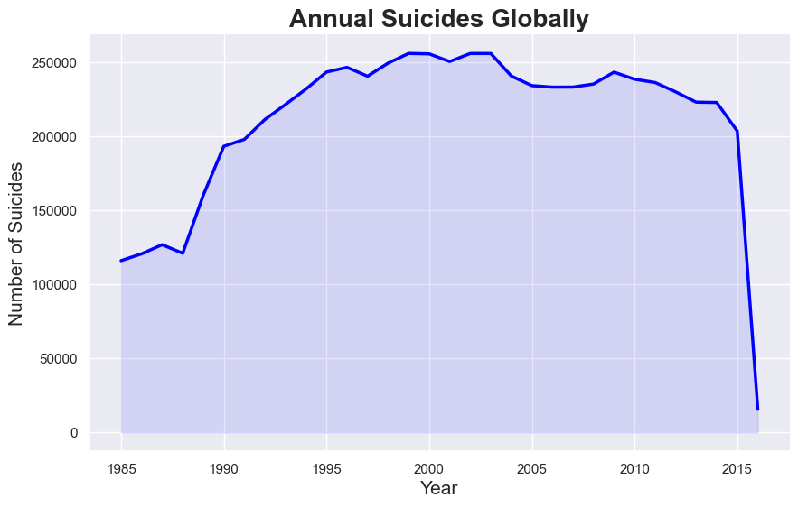
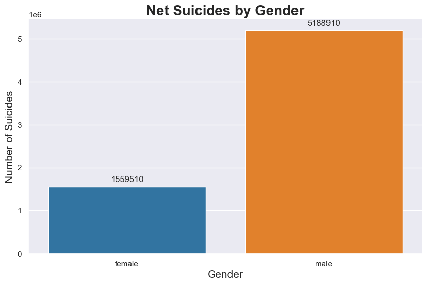
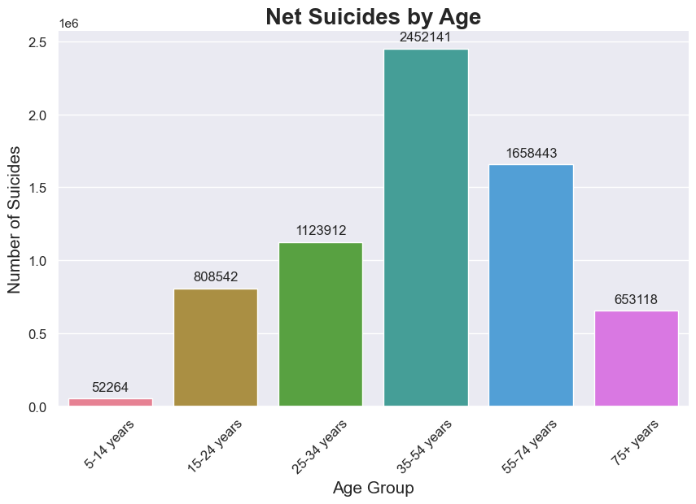
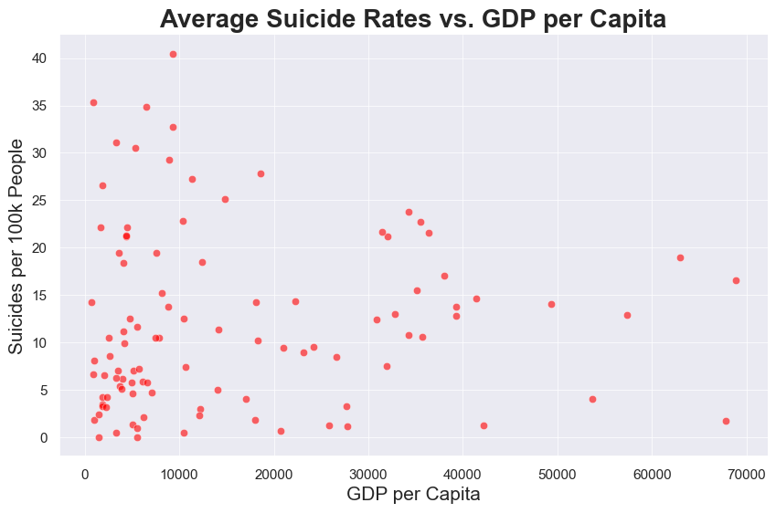
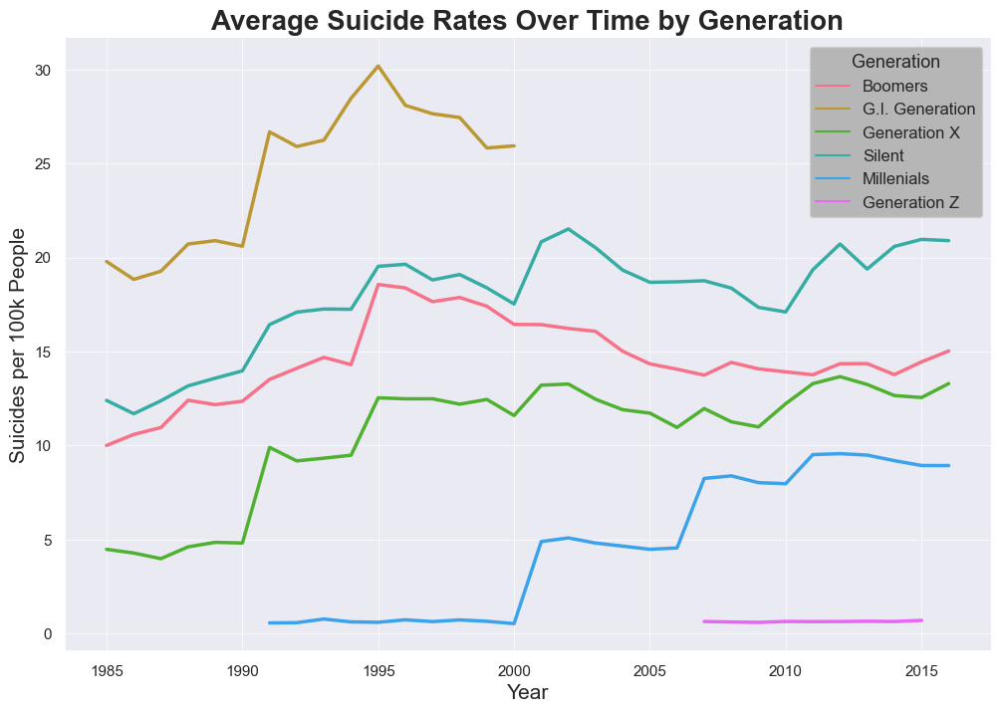
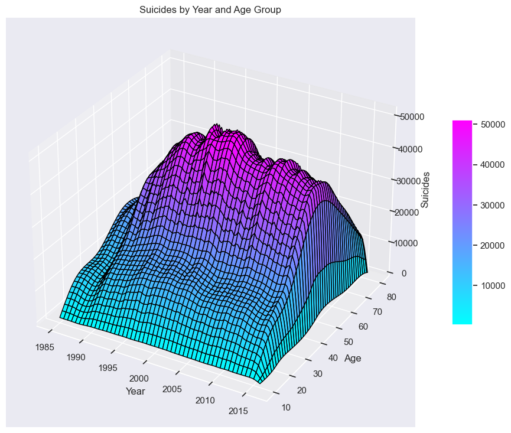

# Dissecting Suicide Rates: A Data Analysis

This project uses the [Suicide Rates Overview 1985 to 2016](https://www.kaggle.com/russellyates88/suicide-rates-overview-1985-to-2016) dataset to analyze global suicide rates and answer the following questions:

- How many people lost their lives to suicide each year?
- Which gender is more likely to commit suicide?
- Which age group tends to have the most victims?
- How are suicide rates related to the GDP per Capita?
- What are the average suicide rates across generations over time?
- When was this issue at its peak?

## Graphs

Here are some graphs generated by the project:
1. 
   
   This line graph shows the total number of suicides globally each year.

2. 

   This bar graph illustrates the total number of suicides by gender.

3. 

   This bar graph shows the total number of suicides by age group.

4. 

   This scatter plot shows the correlation between average suicide rates and GDP per capita.

5. 

   This line graph presents the average suicide rates over time, split by generation.

6. 

   This 3D surface plot shows the suicide rates by year and age group.

## Setup

To run this project, you need to have Python and Jupyter installed on your machine. Here are the steps to get the project running:

1. Clone the repository:
   `git clone https://github.com/raoanmol/Dissecting-Suicide-Rates`
   
2. Change to the directory of the project:
   `cd Dissecting-Suicide-Rates`

3. Install the necessary Python packages using 'requirements.txt':
   `pip install -r requirements.txt`

4. Run the Jupyter notebook:
   `jupyter notebook main.ipynb`

## Contributing

If you would like to contribute to this project, please fork the repository, make your changes, and submit a pull request. I will review your changes and approve them if they are valuable.

## License

This project is licensed under the MIT License. See the [LICENSE](./LICENSE) file for details.